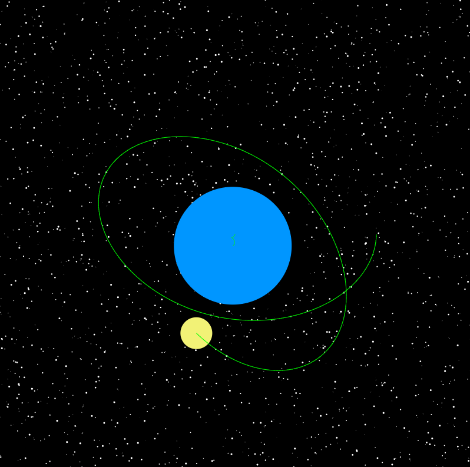
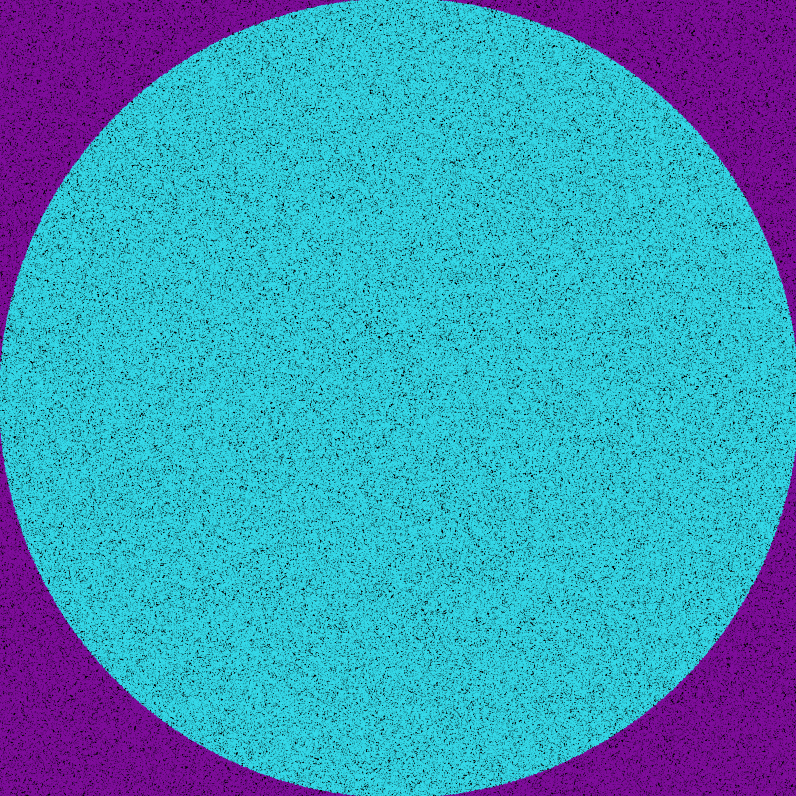
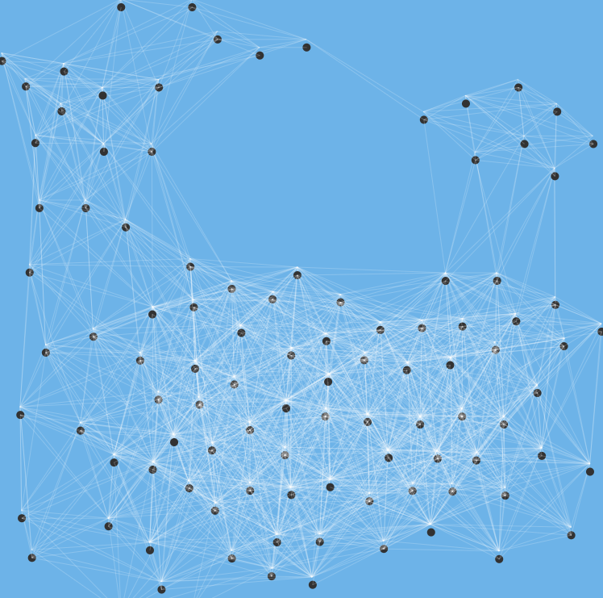
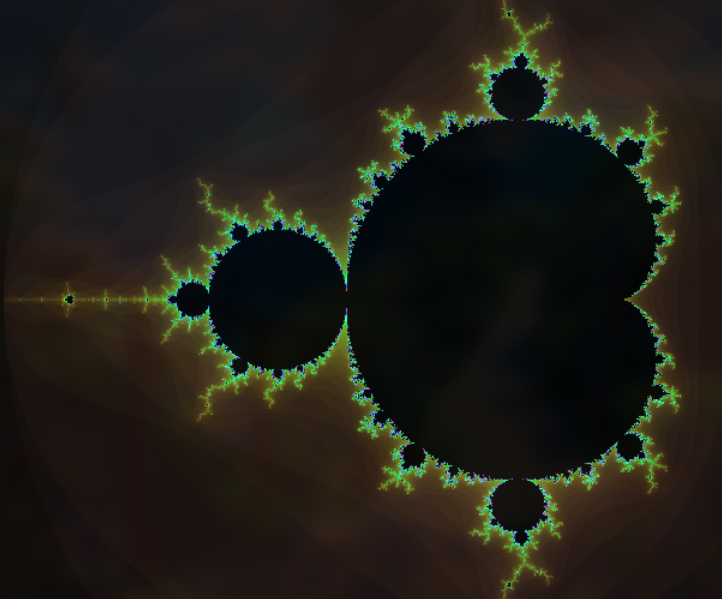
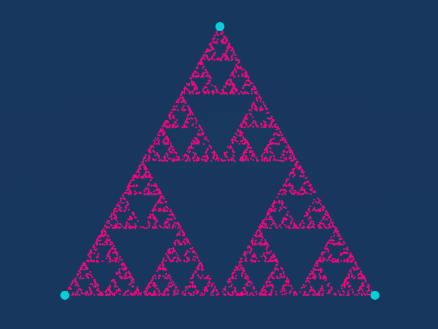

# Exploring Code

Welcome to my collection of projects born from pure curiosity and the joy of coding!

This repository is where I experiment with JavaScript and the [p5.js](https://p5js.org/) library to bring physics, math, and visual ideas to life. Don't expect perfection — I'm a 22-year-old computer science student who loves learning by experimenting and building things from scratch. Each project here started with a "what if?" and turned into hours of fun (and occasional frustration).

A HUGE shoutout to the amazing YouTuber [Sebastian Lague](https://www.youtube.com/@SebastianLague). His *Coding Adventure* series is the PERFECT representation of what this repo is all about: learning the foundations of math and programming by actually building cool stuff. If you don't know his channel and you're into these topics, you're missing out!

---

## The Projects

Here's what I've made so far. Click on any project to try it live!

### Planetary System Simulation

A simplified N-body gravity simulation where you can play god with celestial bodies! Tweak masses, velocities, and watch the chaos unfold. It's not scientifically accurate, but it's fun as hell.

**[Try it here!](https://popirex.github.io/Exploring_Code/Simulazioni/Universo/index.html)**

---

### Estimating π with Monte Carlo

Throwing random points at a circle to calculate π. Yes, really. It's a classic Monte Carlo method that shows how probability and statistics can solve mathematical problems in the most roundabout (but cool) way possible.

**[Try it here!](https://popirex.github.io/Exploring_Code/Simulazioni/MonteCarlo/index.html)**

---

### Boids - Simulating Bird Flocking

This is my favorite! Based on Craig Reynolds' legendary algorithm, this simulation creates realistic flocking behavior using just THREE simple rules: alignment, cohesion, and separation. Watch hundreds of little triangles move together like an actual flock of birds. The emergent behavior that comes from these simple rules is absolutely mesmerizing.

**[Try it here!](https://popirex.github.io/Exploring_Code/Simulazioni/Boids/index.html)**

---

### Mandelbrot Set Explorer

Dive into the infinite beauty of fractals! This interactive visualization lets you see the Mandelbrot set and discover the self-similar patterns that go on forever. It's hypnotic and a great way to appreciate the mathematical beauty hiding in complex numbers.

**[Try it here!](https://popirex.github.io/Exploring_Code/Simulazioni/Mandelbrot/index.html)**

---

### Sierpiński Triangle (Chaos Game)

Another fractal, this time created using the Chaos Game algorithm. Start with a random point, pick a random vertex, move halfway toward it, and repeat. Sounds random, right? But somehow this chaotic process creates the beautiful Sierpiński triangle pattern. Math is WILD.

**[Try it here!](https://popirex.github.io/Exploring_Code/Simulazioni/Sierpinski/index.html)**

---

## What's the Point?

My goal is simple: **learn by creating**.

Each project here started with curiosity. "How does gravity work?" "Can I simulate flocking behavior?" "What even ARE fractals?" And instead of just reading about it, I built something to see it in action. That's how I learn best — hands-on, trial and error, and a lot of debugging.

This repository is my playground where I strengthen my understanding of computer science, math, and physics while having fun doing it.

---

## Technologies Used

- **[p5.js](https://p5js.org/)** – For all the graphics and interactivity magic
- **JavaScript** – The brain behind the simulations
- **HTML/CSS** – Because even simulations need a nice home

---

## About Me

**Popirex**  
Computer science student who fell in love with programming the moment I touched an Arduino.  
I'm passionate about simulations, computational physics, interactive graphics, and pretty much anything that involves making cool stuff with code.

If you want to see more of my work or just chat about code, check out my **[GitHub profile](https://github.com/Popirex)** or visit my **[portfolio website](https://popirex.github.io/)**.

---

## Want to Contribute?

Feel free to open issues, suggest improvements, or submit pull requests! This is a learning project, so any feedback is super welcome.

---

## Thanks for Stopping By!

If you enjoyed these simulations or found them useful, feel free to leave a ⭐ on this repo. It makes me happy and motivates me to keep building more stuff!

**Made with curiosity and caffeine by Popirex**